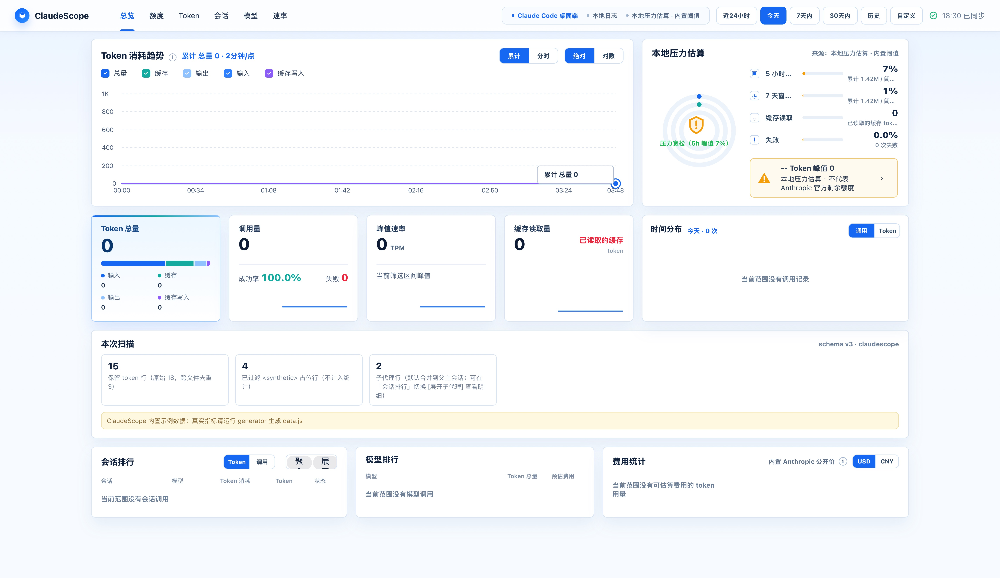

# ClaudeScope

[简体中文](README.md) | [English](README.en.md)

ClaudeScope 是一个本地优先的 Claude Code 用量面板。扫描本机 `~/.claude/projects/` 下的会话日志，把 token 消耗、模型分布、会话/子代理排行、缓存创建率和费用估算整理成可以直接打开的浏览器仪表盘。

它是一个静态 HTML 页面：没有后端、没有账号接入、没有远端遥测。真实用量只会写到本地 `data.js`，并被默认的 `.gitignore` 排除。



## 为什么做

跑 Claude Code 多 workspace 工作流的时候，每天产生大量 jsonl 会话日志。光看零散日志很难判断：

- 这一天 / 这一周烧了多少 token、多少美元
- 哪个 workspace、哪个会话最烧
- 哪个模型用得最多（Opus 4.7 / Sonnet 4.6 / Haiku 4.5）
- 5 小时滑动窗口的本地压力——避免在不知情时撞上 rate limit
- subagent 真实消耗——默认聚合到主会话，需要时一键展开看明细

ClaudeScope 把这些指标算在本地，不上传到任何服务器。

## 不是什么

ClaudeScope 显示的是**本地压力估算**，不是官方剩余额度。Anthropic 不公开账户级 quota；面板上的 5 小时 / 7 天压力百分比用的是「窗口内累计 token / 社区估算阈值」，仅用于"本地预警"。真正的额度状态请以 Anthropic 控制台为准。

唯一来自 Anthropic 真实信号的指标是 v1.0.1 新增的 **rate-limit 命中计数** —— 那是从你 jsonl 里 429/529 错误行抓出来的，是「Anthropic 真的拒绝了你」。

## 功能

- token 累计趋势（输入 / cache_read / cache_creation / 输出 4 个维度）
- 范围切换：近 24 小时、今天、近 7 天、近 30 天、历史总览、自定义区间
- 会话排行 + 模型排行：合并主会话 / 子代理；toggle 切到展开视图
- 本地压力估算：5 小时 + 7 天双窗口，琥珀橙配色 + 显式 disclaimer
- preset 一键切换：`--preset pro / max-5x / max-20x / custom`，自动按 Pro 基线放大阈值
- overflow 透传：当真实倍数超过阈值（如 2.3×），UI 显示 `100% · 2.3×` 而不是看起来"才刚到 100%"
- rate-limit 真实信号：从 jsonl 里 429 / 529 错误行抓出来的命中计数（7d / 30d / 全部）
- 费用估算：按 Anthropic 公开美元价格表，未定价模型给醒目"未定价"徽章
- 自定义价格：`~/.claude-scope/pricing.json` 完全 override 内置规则
- 自定义阈值 + weights：`~/.claude-scope/risk.json` 调整 5h / 7d 压力窗口 + 容量权重
- `<synthetic>` 占位行自动过滤，不污染统计
- macOS / Windows 双平台启动器，发布包内置预编译二进制，普通用户不用装 Go

## 快速开始

普通用户建议下载 Release 包：

- **macOS**：解压 `ClaudeScope-mac.zip`，双击根目录的 `Open ClaudeScope.command`
- **Windows**：解压 `ClaudeScope-windows.zip`，双击根目录的 `Open ClaudeScope.cmd`

启动器会先在本地跑 generator 写出 `data.js`，然后用系统默认浏览器打开 `index.html`。再次运行只会重扫变化的会话日志。

> macOS 拦截 `Open ClaudeScope.command` 时：**系统设置 → 隐私与安全性 → 仍要打开**；或在终端跑 `xattr -dr com.apple.quarantine .`。

> GitHub 自动生成的 **Source code (zip)** 是给开发者看的源码包，不是普通用户入口。

## 命令行

发布包内的 `claudescope` 二进制和源码仓的 `bin/claude-scope` 都接受三个子命令：

```bash
claudescope generate [--root <dir>] [--out <file>] [--since <RFC3339>] [--window-days <n>] [--preset <pro|max-5x|max-20x|custom>]
claudescope open     [--out <file>]
claudescope version
```

- `generate`：扫描 `~/.claude/projects/`，写入 `data.js`
- `--preset`：本地压力 preset。CLI > `risk.json` 文件 preset > 内置 `pro`
- `open`：在系统默认浏览器中打开 `data.js` 同目录的 `index.html`
- `version`：打印版本号

源码仓内可以直接：

```bash
npm run build              # 构建前端 + bin/claudescope
./bin/claude-scope generate
./bin/claude-scope open
```

## 配置文件

两个可选 JSON 文件，都放在 `~/.claude-scope/`：

| 文件 | 作用 | 详细文档 |
|------|------|----------|
| `pricing.json` | 自定义模型价格（USD per 1M tokens） | [docs/pricing-config.md](docs/pricing-config.md) |
| `risk.json` | 自定义本地压力窗口阈值 | [docs/risk-config.md](docs/risk-config.md) |

文件不存在时用内置默认；存在但格式不合法时（缺 patterns、负价格、JSON 损坏等），generator 会打印警告并回退到内置默认，**不会**让仪表盘黑屏。

## 项目结构

```
claude-scope/
├── index.html              静态面板外壳
├── styles.css              视觉样式
├── app.ts / app.js         浏览器逻辑（TS 源 → 编译产物）
├── data.sample.js          内置示例数据
├── bin/                    源码仓 CLI 入口
│   └── claude-scope        bash 调度器（dev 用）
├── generator/              Go 解析器与生成器
│   ├── cmd/
│   │   ├── claudescope/    多子命令主入口（generate/open/version）
│   │   └── generate/       早期单命令入口（保留向后兼容）
│   ├── parser/             jsonl 解析、dedup、catalog、recordsV3
│   ├── pricing/            pricing.json 加载与校验
│   └── risk/               本地压力滑窗
├── fixtures/               单测与 P4 走查 fixture
├── docs/                   schema / pricing / risk 文档
├── scripts/
│   ├── build-release.sh    构建分平台 release zip
│   └── p4-walkthrough.sh   Phase 4 浏览器走查辅助
├── macos/open-dashboard.command
└── windows/open-dashboard.cmd
```

## 数据流

1. Claude Code 把本机会话日志写到 `~/.claude/projects/<encoded-cwd>/<session-uuid>.jsonl`
2. 子代理写到 `~/.claude/projects/<encoded-cwd>/<parent-uuid>/subagents/agent-<id>.jsonl`
3. `claudescope generate` 扫描全部 `*.jsonl`，提取每条 message 的 `usage` 字段（不解析对话内容）
4. 通过路径关系把子代理 token 合并到父会话；同时保留 `parentSidIdx` 让前端可以一键展开
5. 加载 `pricing.json` / `risk.json`（缺则用内置默认），算费用 + 本地压力
6. 输出包成 `window.CLAUDESCOPE_DATA = {...}` 写到 `data.js`
7. `index.html` 加载 `data.sample.js` 兜底，再被真实 `data.js` 覆盖

## 隐私

ClaudeScope 不会把数据发送到任何服务器。生成器只读 jsonl 里 message 级别的元数据：

- 会话 id 和工作目录 basename（不含完整路径）
- 模型名、token 数（input / cache_read / cache_creation / output）
- 时间戳、子代理父子关系、API 失败状态

它**不会**导出对话内容、提示词、助手回复、工具输出、文件内容。

分享截图或 `data.js` 之前建议先检查一遍。

## 费用估算说明

费用只是基于本地 token 数量 × 公开价格表的估算，不是官方账单。Anthropic 实际计费请以官方控制台为准。USD 是原始计算单位；CNY 仅为前端参考换算（联网时取 ECB/Frankfurter 汇率，离线退到内置参考值），不能作为账单依据。

## 数据 schema

详见：

- [docs/schema-v3.md](docs/schema-v3.md) — V3 主格式定义
- [docs/schema-v2-compat.md](docs/schema-v2-compat.md) — V2 兼容降级路径

## 构建 release 包

```bash
npm install
npm run release:local
```

输出：

- `dist/ClaudeScope-mac.zip`
- `dist/ClaudeScope-windows.zip`

二进制名嵌入 `package.json` 里的 `version`，可通过 `CLAUDESCOPE_VERSION=1.0.1 npm run release:local` 覆盖。

## 开发者：响应式布局回归

`npm run verify` 用 Playwright 跑响应式布局快照。首次执行需要先装浏览器：

```bash
npm install
npx playwright install
npm run verify
```

`npx playwright install` 会下载约 200MB 浏览器二进制；普通用户使用 release 包不需要这一步。

## 致谢

ClaudeScope fork 自社区项目 [CodexScope](https://github.com/JUk1-GH/CodexScope)（OpenAI Codex 用量面板），基础架构、`buildView` 框架、时间工具、worker pool、release 打包流程都来自上游。本仓库在此基础上把数据源切到 Claude Code，加上 `cache_creation_input_tokens` 维度、subagent 父子合并、本地压力估算、自定义 pricing/risk 配置等改造。

Fork 起点：

- 上游：<https://github.com/JUk1-GH/CodexScope>
- 上游 commit：`21fcc718de232cca7f3453f9156bf8fec1e2aae0`（2026-05-10）

感谢 CodexScope 作者把"本地优先、零后端、单文件 HTML 仪表盘"这条路趟出来。

## License

MIT
